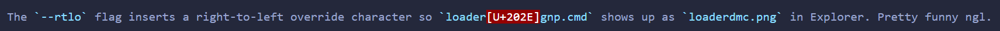

# Interium

PE binary obfuscator I wrote for my own stealer [Kurion](https://discord.gg/p873k2Fy3). Messes with PE metadata, imports, sections, etc. to make executables harder to signature. Also has a binder mode that wraps an exe into an obfuscated `.cmd` script.

**Note:** This source is kinda old and Kurion is no longer using this.

## what it does

**Crypter mode** (default)
- Strips Rich header, debug info, timestamps
- Replaces DOS stub with standard one
- Renames packer/protector section names (`.UPX0` -> `.data`)
- Shuffles import descriptor order
- Spoofs linker version to look like normal MSVC output
- Adds fake Authenticode certificate overlay
- Recalculates PE checksum

**Binder mode**
- Takes an exe, base64 encodes it, embeds into a `.cmd` script
- PowerShell decode extracts and runs it from %TEMP%
- Batch-level obfuscation: random variables, string atomization, junk comments, goto spaghetti
- Optional: hidden window, self-delete, RTLO filename trick

Three obfuscation levels: `low`, `mid`, `high`. Each one stacks on top of the previous.

## building

Need CMake 3.16+ and a C++17 compiler.

**Linux** (builds the CLI tool + cross-compiles the stub with mingw):
```bash
./build.sh
```
If you don't have mingw-w64 it'll just skip the stub. Install with `sudo apt install mingw-w64`.

**Windows** (MSVC):
```powershell
.\build.ps1
```
Builds both the builder and the stub.

## usage

```bash
# basic : strips metadata + rich header
./interium --file malware.exe --level low

# mid : also shuffles imports and spoofs PE characteristics
./interium --file malware.exe --level mid

# high : adds fake cert overlay on top of everything
./interium --file malware.exe --level high --output clean.exe

# binder : wrap exe into obfuscated cmd
./interium --mode binder --file payload.exe --level high --output loader.cmd

# binder with extras
./interium --mode binder --file payload.exe --level high --self-delete --hidden --rtlo
```



## ai disclosure

Some parts were written with AI because I'm lazy and didn't feel like looking things up:

- **S-box / inverse S-box tables** in `crypto.cpp`
- **DOS stub bytes** in `transforms.cpp` the standard "This program cannot be run in DOS mode" stub. Copied the byte sequence from AI output
- **PE struct definitions** in `pe.h` the field names and offsets are from the PE spec, I just had AI lay them out as C++ structs instead of manually transcribing from the docs
- **ASN.1 header bytes** in `transforms.cpp` `addOverlay()` the fake Authenticode structure prefix. I know what it's supposed to look like but didn't memorize the OID bytes

Everything else (the actual logic, obfuscation strategies, binder pipeline, batch obfuscation engine) is mine. The AI parts are basically just reference data that I could have copied from docs/tables but chose not to.

## limitations

- Won't bypass anything that does behavioral analysis or sandboxing **this is static-level only**
- Binder mode PowerShell extraction will get caught by AMSI if the target has decent AV
- The fake cert overlay doesn't survive signature verification (obviously), it's just there to pad the binary and confuse static parsers
- Stub manual mapper doesn't handle exception directories or delay-load imports

## license

Do whatever you want with it. If you use this for anything illegal that's on you.
